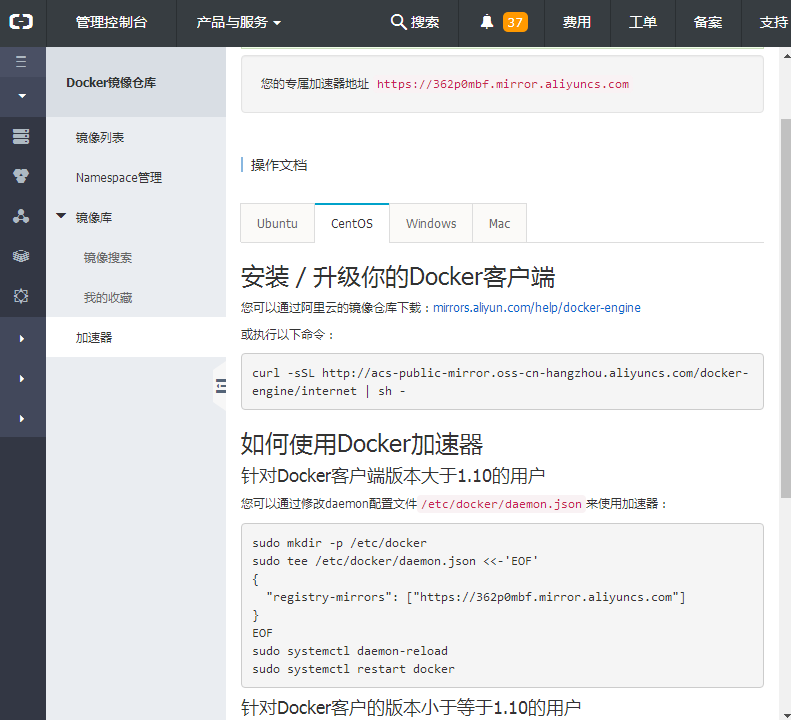

# 配置镜像加速器

国内访问Docker Hub的速度很不稳定，有时甚至出现连接不上的情况。本节我们来为Docker配置镜像加速器，从而解决这个问题。目前国内很多云服务商都提供了镜像加速的服务。

常用的镜像加速器有：阿里云加速器、DaoCloud加速器等。各厂商镜像加速器的使用方式大致类似，笔者以阿里云加速器为例进行讲解。

1. 注册阿里云账号后，即可在阿里云控制台（[https://cr.console.aliyun.com/#/accelerator](https://cr.console.aliyun.com/#/accelerator)）看到类似如下的页面。

   

2. 按照图中的说明，即可配置镜像加速器。