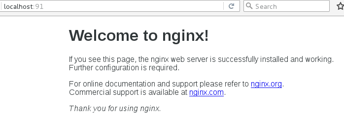

# 容器常用命令

本节我们来讨论Docker容器的常用命令。


## 新建并启动容器[重要]

使用以下`docker run` 命令即可新建并启动一个容器。该命令是我们最常用的命令了，它有很多选项，下面笔者列举一些常用的选项。

① -d选项：表示后台运行

② -P选项：随机端口映射

③ -p选项：指定端口映射，有以下四种格式。

ip:hostPort:containerPort

ip::containerPort

hostPort:containerPort

containerPort

④ --network选项：指定网络模式，该选项有以下可选参数：

--network=bridge： 默认选项，表示连接到默认的网桥。

--network=host：容器使用宿主机的网络。 

--network=container:NAME_or_ID：告诉Docker让新建的容器使用已有容器的网络配置。

--network=none：不配置该容器的网络，用户可自定义网络配置。

示例1：

```shell
docker run java /bin/echo 'Hello World'
```

这样终端会打印Hello World的字样，跟在本地直接执行`/bin/echo 'Hello World'` 一样。

示例2：

```shell
docker run -d -p 91:80 nginx
```

这样就能启动一个Nginx容器。在本例中，我们为docker run添加了两个参数，含义如下：

```shell
-d                           # 后台运行
-p 宿主机端口:容器端口         # 开放容器端口到宿主机端口
```

访问[http://Docker宿主机IP:91/](http://Docker宿主机IP:91/) ，将会看到如图12-3的界面：



图12-3 Nginx首页

**TIPS**

需要注意的是，使用docker run命令创建容器时，会先检查本地是否存在指定镜像。如果本地不存在该名称的镜像，Docker就会自动从Docker Hub下载镜像并启动一个Docker容器。


## 列出容器[重要]

使用`docker ps` 命令即可列出运行中的容器。执行该命令后，可看到类似于如下的表格。

```
CONTAINER ID        IMAGE               COMMAND                  CREATED             STATUS              PORTS                         NAMES
784fd3b294d7        nginx               "nginx -g 'daemon off"   20 minutes ago      Up 2 seconds        443/tcp, 0.0.0.0:91->80/tcp   backstabbing_archimedes
```

如需列出所有容器（包括已停止的容器），可使用-a参数。

该表格包含了七列，含义如下：

① CONTAINER_ID：表示容器ID。

② IMAGE：表示镜像名称。

③ COMMAND：表示启动容器时运行的命令。

④ CREATED：表示容器的创建时间。

⑤ STATUS：表示容器运行的状态。Up表示运行中，Exited表示已停止。

⑥ PORTS：表示容器对外的端口号。

⑦ NAMES：表示容器名称。该名称默认由Docker自动生成，也可使用docker run命令的--name选项自行指定。

命令格式：

```
docker ps [OPTIONS]
```

参数：

| Name, shorthand | Default | Description                |
| --------------- | ------- | -------------------------- |
| `--all, -a`     | `false` | 列出所有容器，包括未运行的容器，默认只展示运行的容器 |
| `--filter, -f`  |         | 根据条件过滤显示内容                 |
| `--format`      |         | 通过Go语言模板文件展示镜像             |
| `--last, -n`    | `-1`    | 显示最近创建n个容器（包含所有状态）         |
| `--latest, -l`  | `false` | 显示最近创建的容器（包含所有状态）          |
| `--no-trunc`    | `false` | 不截断输出                      |
| `--quiet, -q`   | `false` | 静默模式，只展示容器的编号              |
| `--size, -s`    | `false` | 显示总文件大小                    |

示例：

```
docker ps -n 5
docker ps -a -q
```


## 停止容器[重要]

使用`docker stop` 命令，即可停止容器。

命令格式：

```
docker stop [OPTIONS] CONTAINER [CONTAINER...]
```

参数：

| Name, shorthand | Default | Description       |
| --------------- | ------- | ----------------- |
| `--time, -t`    | `10`    | 强制杀死容器前等待的时间，单位是秒 |

示例：

```shell
docker stop 784fd3b294d7
```

其中`784fd3b294d7` 是容器ID，当然也可使用`docker stop 容器名称` 来停止指定容器。


## 强制停止容器[重要]

可使用`docker kill` 命令停止一个或更多运行着的容器。

命令格式：

```
docker kill [OPTIONS] CONTAINER [CONTAINER...]
```

参数：

| Name, shorthand | Default | Description |
| --------------- | ------- | ----------- |
| `--signal, -s`  | `KILL`  | 向容器发送一个信号   |

例如：

```shell
docker kill 784fd3b294d7
```


## 启动已停止的容器[重要]

使用`docker run` 命令，即可新建并启动一个容器。对于已停止的容器，可使用`docker start` 命令来启动。

命令格式：

```
docker start [OPTIONS] CONTAINER [CONTAINER...]
```

参数：

| Name, shorthand     | Default | Description          |
| ------------------- | ------- | -------------------- |
| `--attach, -a`      | `false` | 连接STDOUT/STDERR并转发信号 |
| `--checkpoint`      |         | 从该检查点还原              |
| `--checkpoint-dir`  |         | 使用自定义的检查点存储目录        |
| `--detach-keys`     |         | 覆盖断开容器的关键顺序          |
| `--interactive, -i` | `false` | 连接容器的STDIN           |

例如：

```shell
docker start 784fd3b294d7
```


## 重启容器[重要]

可使用`docker restart` 命令来重启容器。该命令实际上是先执行了`docker stop` 命令，然后执行了`docker start` 命令。

命令格式：

```
docker restart [OPTIONS] CONTAINER [CONTAINER...]
```

参数：

| Name, shorthand | Default | Description     |
| --------------- | ------- | --------------- |
| `--time, -t`    | `10`    | 关闭容器前等待的时间，单位是秒 |


## 进入容器[重要]

某场景下，我们可能需要进入运行中的容器。

① 使用`docker attach` 命令进入容器。

例如：

```shell
docker attach 784fd3b294d7
```

很多场景下，使用`docker attach` 命令并不方便。当多个窗口同时attach到同一个容器时，所有窗口都会同步显示。同理，如果某个窗口发生阻塞，其他窗口也无法执行操作。

② 使用`nsenter` 进入容器

nsenter工具包含在util-linux 2.23或更高版本中。为了连接到容器，我们需要找到容器第一个进程的PID，可通过以下命令获取：

```shell
docker inspect --format "{{.State.Pid}}" $CONTAINER_ID
```

获得PID后，就可使用nsenter命令进入容器了：

```shell
nsenter --target "$PID" --mount --uts --ipc --net --pid
```

下面给出一个完整的例子：

```
[root@localhost ~]# docker ps
CONTAINER ID        IMAGE               COMMAND                  CREATED             STATUS              PORTS                         NAMES
784fd3b294d7        nginx               "nginx -g 'daemon off"   55 minutes ago      Up 3 minutes        443/tcp, 0.0.0.0:91->80/tcp   backstabbing_archimedes
[root@localhost ~]# docker inspect --format "{{.State.Pid}}" 784fd3b294d7
95492
[root@localhost ~]# nsenter --target 95492 --mount --uts --ipc --net --pid
root@784fd3b294d7:/# 
```

读者也可将以上两条命令封装成一个Shell，从而简化进入容器的过程。

③ docker exec

```shell
docker exec -it 容器id /bin/bash
```


## 删除容器[重要]

使用`docker rm` 命令即可删除指定容器。

命令格式

```
docker rm [OPTIONS] CONTAINER [CONTAINER...]
```

参数：

| Name, shorthand | Default | Description             |
| --------------- | ------- | ----------------------- |
| `--force, -f`   | `false` | 通过SIGKILL信号强制删除正在运行中的容器 |
| `--link, -l`    | `false` | 删除容器间的网络连接              |
| `--volumes, -v` | `false` | 删除与容器关联的卷               |

例1：删除指定容器。

```shell
docker rm 784fd3b294d7
```

该命令只能删除已停止的容器，如需删除正在运行的容器，可使用-f参数。

例2：删除所有的容器。

```shell
docker rm -f $(docker ps -a -q)
```


## 导出容器

将容器导出成一个压缩包文件。

命令格式：

```
docker export [OPTIONS] CONTAINER
```

参数：

| Name, shorthand | Default | Description     |
| --------------- | ------- | --------------- |
| `--output, -o`  |         | 将内容写到文件而非STDOUT |

示例：

```
docker export red_panda > latest.tar
docker export --output="latest.tar" red_panda
```


## 导入容器

使用`docker import` 命令即可从归档文件导入内容并创建镜像。

命令格式：

```
docker import [OPTIONS] file|URL|- [REPOSITORY[:TAG]]
```

参数：

| Name, shorthand | Default | Description           |
| --------------- | ------- | --------------------- |
| `--change, -c`  |         | 将Dockerfile指令应用到创建的镜像 |
| `--message, -m` |         | 为导入的镜像设置提交信息          |

示例：

```
docker import nginx2.tar nginx
```


**拓展阅读**

* Docker的网络：<https://docs.docker.com/engine/userguide/networking/>
* Docker命令：<https://docs.docker.com/engine/reference/commandline/docker/>