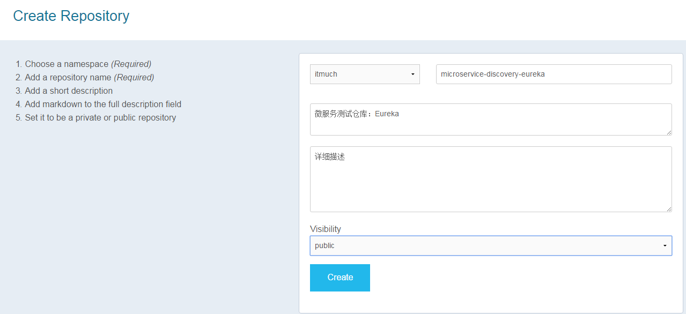

# 使用Docker Hub管理镜像

Docker Hub是Docker官方维护的Docker Registry，上面存放着很多优秀的镜像。不仅如此，Docker Hub还提供认证、工作组结构、工作流工具、构建触发器等工具来简化我们的工作。

前文已经讲过，我们可使用`docker search` 命令搜索存放在Docker Hub中的镜像。本节我们来详细探讨Docker Hub的使用。


## 注册与登录

Docker Hub的使用非常简单，只需注册一个Docker Hub账号，就可正常使用了。登录后，我们可看到Docker Hub的主页，如图所示。


我们也可使用`docker login` 命令登录Docker Hub。输入该命令并按照提示输入账号和密码，即可完成登录。例如：

```shell
$ docker login
Login with your Docker ID to push and pull images from Docker Hub. If you don't have a Docker ID, head over to https://hub.docker.com to create one.
Username: itmuch
Password: 
Login Succeeded
```


## 创建仓库

点击Docker Hub主页上的"Create Repository"按钮，按照提示填入信息即可创建一个仓库。



如图，我们只需填入相关信息，并点击Create按钮，就可创建一个名为microservice-discovery-eureka的公共仓库。


## 推送镜像

下面我们来将前文构建的镜像推送到Docker Hub。使用以下命令即可，例如：

```shell
docker push itmuch/microservice-discovery-eureka:0.0.1
```

经过一段时间的等待，就可推送成功。这样，我们就可在Docker Hub查看已推送的镜像。