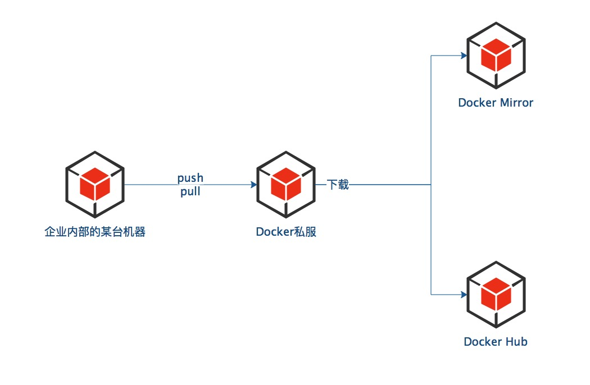

# 使用Docker Registry管理镜像

很多场景下，我们需使用私有仓库管理Docker镜像。相比Docker Hub，私有仓库有以下优势：

(1) 节省带宽，对于私有仓库中已有的镜像，无需从Docker Hub下载，只需从私有仓库中下载即可；

(2) 更加安全；

(3) 便于内部镜像的统一管理。

本节我们来探讨如何搭建、使用私有仓库。可使用docker-registry项目或者Docker Registry 2.0来搭建私有仓库，但docker-registry已被官方标记为过时，并且已有2年不维护了，不建议使用。

我们先用Docker Registry 2.0搭建一个私有仓库，然后将Docker镜像推送到私有仓库。


## 原理图




## 搭建Docker Registry 2.0

Docker Registry 2.0的搭建非常简单，只需执行以下命令即可新建并启动一个Docker Registry 2.0。

```shell
docker run -d -p 5000:5000 --restart=always --name registry2 registry:2
```


## 将镜像推送到Docker Registry 2.0

前文我们使用`docker push` 命令将镜像推送到了Docker Hub，现在我们将前文构建的itmuch/microservice-discovery-eureka:0.0.1推送到私有仓库。

只需指定私有仓库的地址，即可将镜像推送到私有仓库。

```shell
docker push localhost:5000/itmuch/microservice-discovery-eureka:0.0.1
```

执行以上命令，我们发现推送并没有成功，且提示以下内容：

```
The push refers to a repository [localhost:5000/itmuch/microservice-discovery-eureka]
An image does not exist locally with the tag: localhost:5000/itmuch/microservice-discovery-eureka
```

我们知道，Docker Hub是默认的Docker Registry，因此，itmuch/microservice-discovery-eureka:0.0.1相当于docker.io/itmuch/microservice-discovery-eureka:0.0.1。因此，要想将镜像推送到私有仓库，需要修改镜像标签，命令如下：

```shell
docker tag itmuch/microservice-discovery-eureka:0.0.1 localhost:5000/itmuch/microservice-discovery-eureka:0.0.1
```

修改镜像标签后，再次执行以下命令，即可将镜像推送到私有仓库。

```shell
docker push localhost:5000/itmuch/microservice-discovery-eureka:0.0.1
```


## TIPS

(1) docker-registry的GitHub：[https://github.com/docker/docker-registry](https://github.com/docker/docker-registry) 

(2) Docker Registry 2.0的GitHub：[https://github.com/docker/distribution](https://github.com/docker/distribution)

(3) 本节中“私有仓库”表示私有Docker Registry，并非Docker中仓库的概念。

(4) Docker Registry 2.0需要Docker版本高于1.6.0。

(5) 我们还可为私有仓库配置域名、SSL登录、认证等。限于篇幅，本书不作赘述。有兴趣的读者可参考笔者的开源书：<https://gitee.com/itmuch/spring-cloud-book/blob/master/3%20%E4%BD%BF%E7%94%A8Docker%E6%9E%84%E5%BB%BA%E5%BE%AE%E6%9C%8D%E5%8A%A1/3.5%20Docker%E7%A7%81%E6%9C%89%E4%BB%93%E5%BA%93%E7%9A%84%E6%90%AD%E5%BB%BA%E4%B8%8E%E4%BD%BF%E7%94%A8.md>。

(6) Docker Registry 2.0能够满足我们大部分场景下的需求，但它不包含界面、用户管理、权限控制等功能。如果想要使用这些功能，可使用Docker Trusted Registry。
