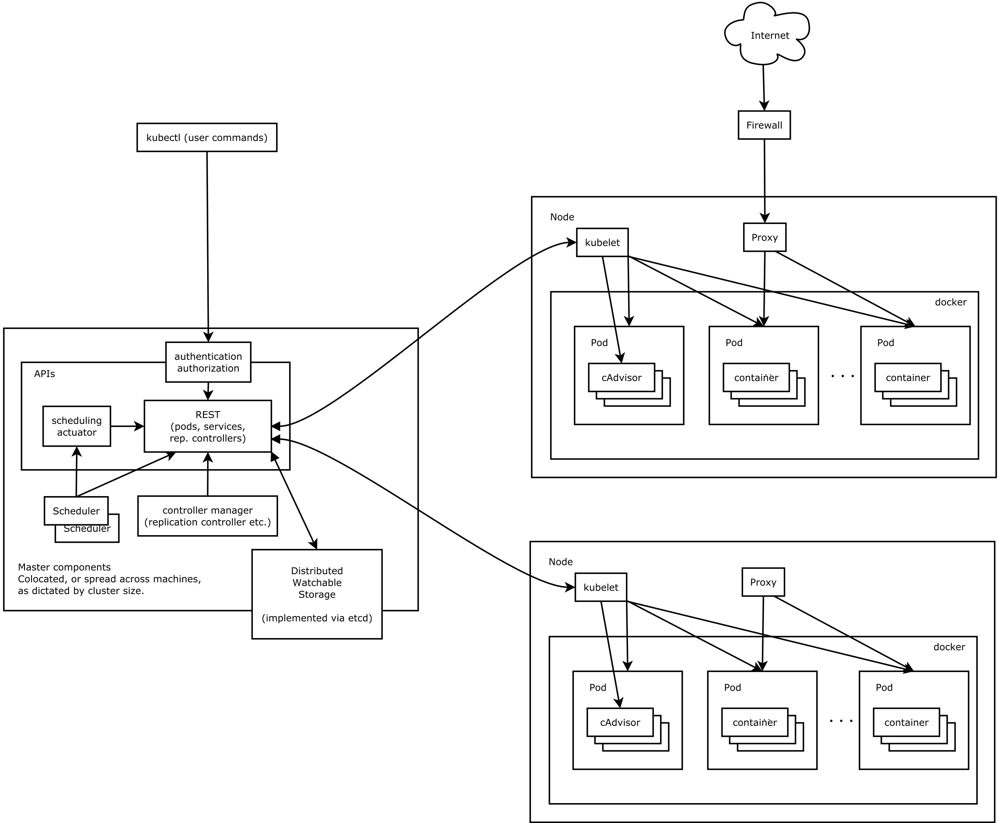
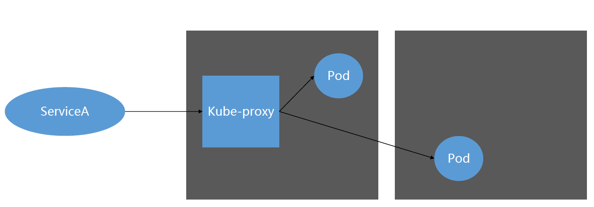

# K8s架构及基本概念

## 架构图




## Master（主节点）

K8s里的Master指是集群控制节点，一个K8s集群需要有一个Master节点来负责整个集群的管理和控制，一般来说，K8s的所有控制命令都是发送给Master，然后由Master来负责具体的执行过程。

Master通常会部署在一个独立的服务器或虚拟机上，它是整个集群的首脑，如果Master宕机或不可用，那么我们所有的控制命令都将会失效。

Master节点上运行着如下的关键进程：

* API Server：K8s里所有资源增删改查等操作的对外入口，也是集群控制的入口进程，它提供了HTTP RESTful API接口给客户端以及其他组件调用。
* Controller Manager：Controller Manager是K8s里所有对象的自动化控制中心。顾名思义，它负责管理“Controller”，主要有：
  * endpoint-controller：刷新服务和pod 的关联信息
  * replication-controller：维护某个 pod 的副本数为配置的数值
* Scheduler：负责资源调度（Pod调度），将Pod分配到某个节点上。
* [可能有]etcd：资源对象存储中心，K8s的所有资源对象数据都存储在此。


## Node（工作节点）

在K8s集群中，除Master以外的其他机器被称为Node节点。与Master一样，Node节点也可以是一台物理机或虚拟机。

由于Node节点才是K8s集群中的工作

* kubelet：负责Pod所对应的容器的生命周期管理，例如容器的创建、启停等。根据从etcd中获取的信息来管理容器、上报Pod运行状态等。
* kube-proxy：实现K8s Service的通信与负载均衡机制。
* docker：你懂的


## Pod（容器组）

Pod是由若干容器组成的容器组，同一个Pod内的所有容器运行在同一主机上，这些容器使用相同的网络命令空间、IP地址和端口，相互之间能通过localhost来发现和通信。

不仅如此，同一个Pod内的所有容器还共享存储卷，这个存储卷也被称为Pod Volume。

在k8s中创建，**调度和管理的最小单位就是Pod**，而非容器，Pod通过提供更高层次的抽象，提供了更加灵活的部署和管理模式。


## Replication Controller（RC）

RC是用来管理Pod的工具，每个RC由一个或多个Pod组成。

* 在RC被创建之后，系统将会保持RC中可用的Pod个数与创建RC时定义的Pod个数一致。
  * 如果Pod个数小于定义的个数，RC会启动新的Pod
  * 反之则会杀死多余的Pod。

我们常会使用YAML定义一个RC，例如：

```yaml
apiVersion: v1                        # API版本
kind: ReplicationController           # 定义一个RC
metadata:
  name: mysql                         # RC名称，全局唯一
spec:
  replicas: 1
  selector:
    app: mysql                        # RC的POD标签选择器，即：监控和管理拥有这些标签的POD实例，确保当前集群中有且只有replicas个POD实例在运行
  template:
    metadata:
      labels:                         # 指定该POD的标签
        app: mysql                    # POD副本拥有的标签，需要与RC的selector一致
    spec:
      containers:
      - name: mysql
        image: mysql
        ports:
        - containerPort: 3306
        env:
        - name: MYSQL_ROOT_PASSWORD
          value: "123456"
```

如上所示，一个RC的定义一般包含了如下三部分：

* Pod所期待的副本数
* 筛选Pod的标签选择器：RC通过Label来关联对应的Pod
* Pod模板：当集群中Pod的副本数量小于（大于）期望值时，K8s就会使用该模板去创建（删除）新的Pod。


## Service

Service可以简单理解成一组提供相同服务的Pod的对外访问入口。Service与Pod之间通过Selector来绑定。下图简单说明了Service与Pod之间的关系



**提问**：RC、Pod、Service三者之间的关系是怎样的？


## 参考文档

容器Docker与kubernetes：<http://www.cnblogs.com/stonehat/p/5148455.html>

Kubernetes扫盲：<http://blog.csdn.net/frank_zhu_bj/article/details/51824697>

Kubernetes微服务架构应用实践：<http://www.chinacloud.cn/show.aspx?id=24091&cid=12>

