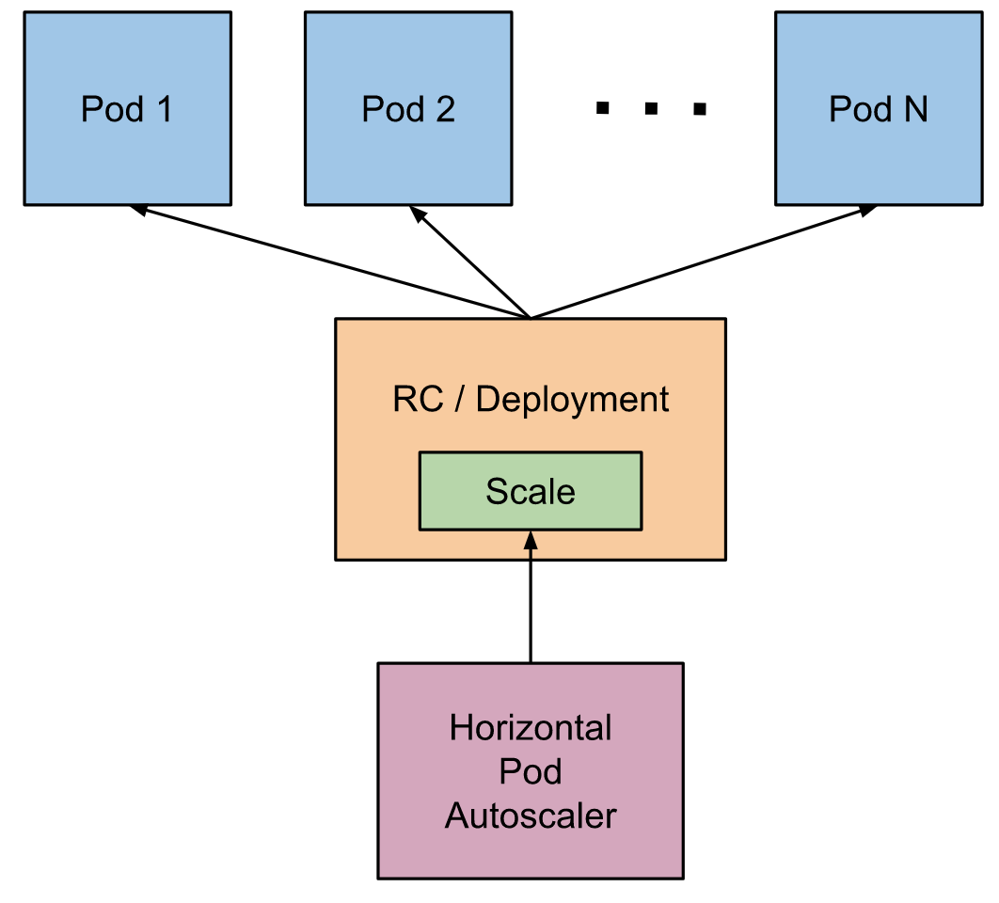

# Horizontal Pod Autoscaling（HPA）

本文描述了Kubernetes中Horizontal Pod Autoscaling的当前状态。

## What is Horizontal Pod Autoscaling?（什么是HPA）

使用HPA，Kubernetes会根据观察到的CPU利用率（或根据在其他应用提供的度量标准，Beta状态）自动缩放Replication Controller、Deployment或ReplicaSet中的Pod个数。请注意，HPA不适用于无法缩放的对象，例如DaemonSet。

Horizontal Pod Autoscaler实现为Kubernetes API资源和Controller。资源决定了Controller的行为。Controller定期调整Replication Controller或Deployment中的副本数，从而将观察到的平均CPU利用率与用户指定的目标相匹配。

## How does the Horizontal Pod Autoscaler work?（Horizontal Pod Autoscaler如何工作）

Horizontal Pod Autoscaler被实现为一个控制回路，由Controller Manager的 `--horizontal-pod-autoscaler-sync-period` 标志（默认值为30秒）控制循环周期。

在每个周期内，Controller Manager根据每个HorizontalPodAutoscaler定义中指定的指标来查询资源利用。 Controller Manager从资源指标API（针对per-pod的资源指标）或自定义指标API（所有其他指标）中获取指标。

- 对于per-pod的资源指标（如CPU），Controller从每个pod的资源指标API中获取指标，这些Pod是由HorizontalPodAutoscaler定位的。然后，如果设置了目标利用率值，则Controller计算利用率的值，跟每个pod中的容器上的资源请求的百分比相同。如果设置了目标原始值，则直接使用原始指标值。然后，Controller在所有目标pod中，获取利用率或原始值（取决于指定的目标类型）的平均值，并产生用于缩放期望的副本数量的比率。

  请注意，如果某些pod的容器未设置相应的资源请求，则不会定义pod的CPU利用率，并且autoscaler不会对该指标采取任何操作。有关自动伸缩算法如何工作的更多信息，阅读 [autoscaling algorithm design document](https://git.k8s.io/community/contributors/design-proposals/autoscaling/horizontal-pod-autoscaler.md#autoscaling-algorithm) 。

- 对于per-pod的自定义指标，Controller的功能类似于per-pod的资源指标，除了它适用于原始值而非利用率值。

- 对于对象的指标，获取单个指标（描述所讨论的对象），并与目标值进行比较，从而产生如上所述的比率。

HorizontalPodAutoscaler Controller可以两种不同的方式获取指标：直接使用Heapster访问与使用REST客户端访问。

当直接使用Heapster访问时，HorizontalPodAutoscaler直接通过API Server的service proxy subresource查询Heapster。 需在集群上部署Heapster并在kube-system这个namespace中运行。

有关使用REST客户端访问的详细信息，请参阅 [Support for custom metrics](https://kubernetes.io/docs/tasks/run-application/horizontal-pod-autoscale/#support-for-custom-metrics)  。

autoscaler通过 scale sub-resource访问相应的Replication Controller、Deployment或ReplicaSet。Scale是一个允许您动态设置副本数，并检查其当前状态的接口。有关scale sub-resource的更多细节可在 [here](https://git.k8s.io/community/contributors/design-proposals/autoscaling/horizontal-pod-autoscaler.md#scale-subresource) 找到。

> 译者按：Heapster是一款容器集群监控及性能分析工具，拓展阅读：<https://segmentfault.com/a/1190000007708162> 

## API Object

Horizontal Pod Autoscaler是Kubernetes `autoscaling` API组中的API资源。当前稳定版本中，只包括对CPU自动缩放的支持，可在`autoscaling/v1` API版本中找到。

Beta版本包括对内存以及自定义指标的支持，可以在`autoscaling/v2beta1` 找到。 在`autoscaling/v2beta1` 中引入的新字段，在使用`autoscaling/v1` 时被保留为注释。

有关API对象的更多详细信息，请参见 [HorizontalPodAutoscaler Object](https://git.k8s.io/community/contributors/design-proposals/autoscaling/horizontal-pod-autoscaler.md#horizontalpodautoscaler-object) 。

## Support for Horizontal Pod Autoscaler in kubectl（kubectl对Horizontal Pod Autoscaler的支持）

和所有API资源一样，Horizontal Pod Autoscaler以 `kubectl` 的标准方式支持。可使用`kubectl create` 命令创建一个新的autoscaler；通过`kubectl get hpa` 列出autoscaler；通过`kubectl describe hpa` 获得详细的描述；通过`kubectl delete hpa` 删除autoscaler。

此外，还有一个特殊的`kubectl autoscale` 命令，使用它可轻松创建一个Horizontal Pod Autoscaler。 例如，执行 `kubectl autoscale rc foo --min=2 --max=5 --cpu-percent=80` 将为*foo*这个Replication Controller创建一个autoscaler，目标CPU利用率设置为`80%` ，副本数量介于2和5之间。可在 [here](https://kubernetes.io/docs/user-guide/kubectl/v1.8/#autoscale) 找到 `kubectl autoscale` 的详细文档。

## Autoscaling during rolling update（滚动更新期间的自动缩放）

目前在Kubernetes中，可以通过直接管理Replication Controller或使用Deployment对象来执行 [rolling update](https://kubernetes.io/docs/tasks/run-application/rolling-update-replication-controller/) ，当使用Deployment时，Deployment对象为您管理底层Replication Controller。Horizontal Pod Autoscaler仅支持后一种方法：Horizontal Pod Autoscaler被绑定到Deployment对象，它设置Deployment对象的大小，Deployment负责设置底层Replication Controller的大小。

当直接使用Replication Controller时，Horizontal Pod Autoscaler不能与滚动更新一起工作，即不能将Horizontal Pod Autoscaler绑定到Replication Controller并执行滚动更新（例如使用`kubectl rolling-update` ）。 不行的原因是：当滚动更新创建一个新的Replication Controller时，Horizontal Pod Autoscaler将不会绑定到新的Replication Controller。

## Support for multiple metrics（对多个指标的支持）

Kubernetes 1.6添加了对“基于多个指标缩放”的支持。 可使用`autoscaling/v2beta1` API版本，指定Horizontal Pod Autoscaler扩展的多个指标。 然后，Horizontal Pod Autoscaler Controller将对每个指标进行评估，并根据该指标提出新的规模。 最大建议的规模将被用作新的规模。

## 对自定义指标的支持

**注意** ：Kubernetes 1.2根据使用特殊Annotation的application-specific metrics（特定于应用程序的指标），增加了对缩放的Alpha支持。在Kubernetes 1.6中删除了对这些Annotation的支持，而是使用新的自动缩放API。虽然，用于收集自定义指标的旧方法仍然可用，但是这些指标将不可被Horizontal Pod Autoscaler使用，并且，用于指定要缩放的自定义指标的Annotation，不再由Horizontal Pod Autoscaler Controller执行。

Kubernetes 1.6增加了在Horizontal Pod Autoscaler中使用自定义指标的支持。 您可在`autoscaling/v2beta1` API中，添加Horizontal Pod Autoscaler要使用的自定义指标。这样，Kubernetes就会查询新的自定义指标API来获取适当的自定义指标的值。

### Requirements（需要的条件）

要使用Horizontal Pod Autoscaler的自定义指标，您必须在部署集群时设置必要的配置：

- [Enable the API aggregation layer](https://kubernetes.io/docs/tasks/access-kubernetes-api/configure-aggregation-layer/) （启用API聚合层）

- 使用API aggregation layer注册资源指标API和自定义指标API。 这两个API server必须*在*您的集群上运行。

  - *资源指标API* ：可使用Heapster的资源指标API实现，方法是运行Heapster时将其`--api-server` 标志设为true。
  - *自定义指标API* ：这必须由单独的组件提供。 样板代码，请参阅 [kubernetes-incubator/custom-metrics-apiserver](https://github.com/kubernetes-incubator/custom-metrics-apiserver) 以及 [k8s.io/metrics](https://github.com/kubernetes/metrics) 。

- 为kube-controller-manager设置相应的标志：

  - `--horizontal-pod-autoscaler-use-rest-clients` 应设为true。

  - `--kubeconfig <path-to-kubeconfig>` 或 `--master <ip-address-of-apiserver>`

    请注意，可使用`--master` 或`--kubeconfig` 标志； `--master` 将会覆盖`--kubeconfig` ，如果两者都被指定。这些标志指定API aggregation layer的位置，允许Controller Manager与 API server通信。

    在Kubernetes 1.7中，Kubernetes提供的标准聚合层与kube-apiserver一起运行，因此可使用 `kubectl get pods --selector k8s-app=kube-apiserver --namespace kube-system -o jsonpath='{.items[0].status.podIP}'`找到目标IP。

## Further reading（进一步阅读）

- 设计文档： [Horizontal Pod Autoscaling](https://git.k8s.io/community/contributors/design-proposals/autoscaling/horizontal-pod-autoscaler.md).
- kubectl autoscale 命令： [kubectl autoscale](https://kubernetes.io/docs/user-guide/kubectl/v1.8/#autoscale).
- 使用示例： [Horizontal Pod Autoscaler](https://kubernetes.io/docs/tasks/run-application/horizontal-pod-autoscale-walkthrough/).

## 原文

<https://kubernetes.io/docs/tasks/run-application/horizontal-pod-autoscale/>